# FoxbodyBCM Hardware Photo Index

Status: PHOTOS UPLOADED / IDENTIFICATION STARTED
Last updated: 2026-09-20

This file is the working index for the physical BCM boards and devices. It links each visible label or board function to the planned project name used in the wiring docs and code.

The board photos are now stored in this repository under `assets/images/`. They currently use the original camera filenames. Later, they can be renamed to more descriptive board names if desired.

## Uploaded Hardware Photos

| Repo image | Notes |
|---|---|
| 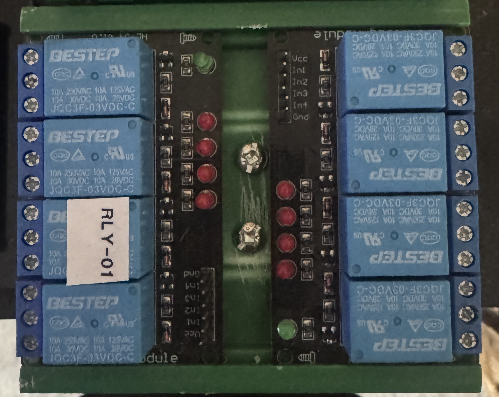 | Hardware photo uploaded from local BCM repo. |
| 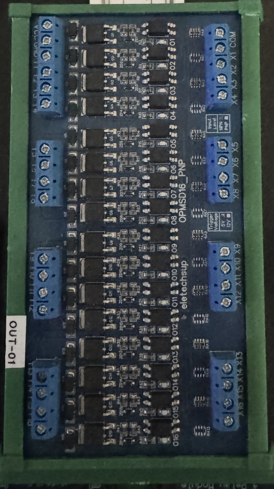 | Hardware photo uploaded from local BCM repo. |
| 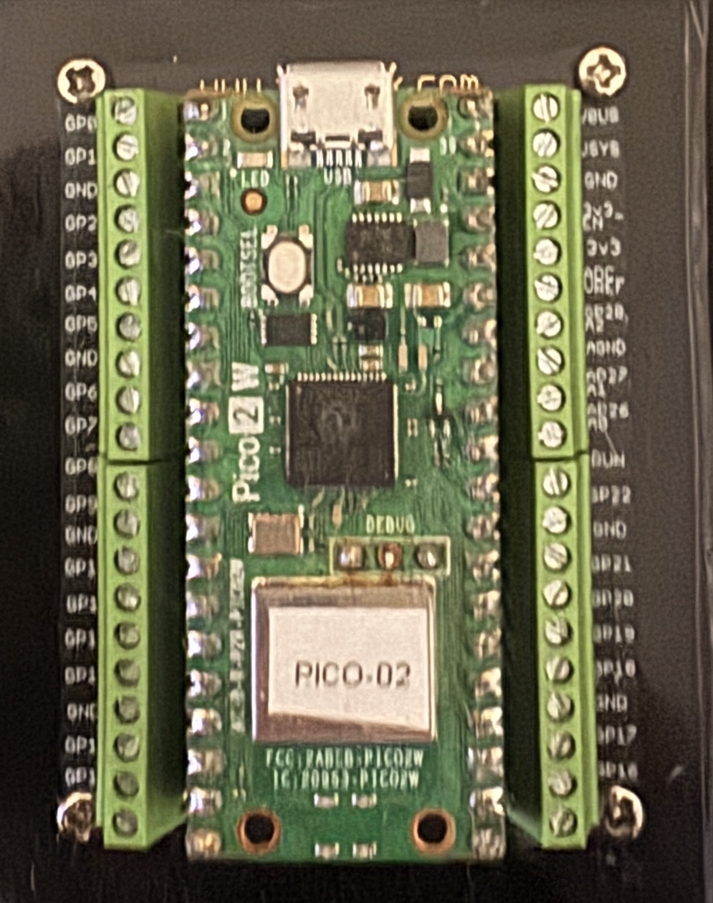 | Hardware photo uploaded from local BCM repo. |
| 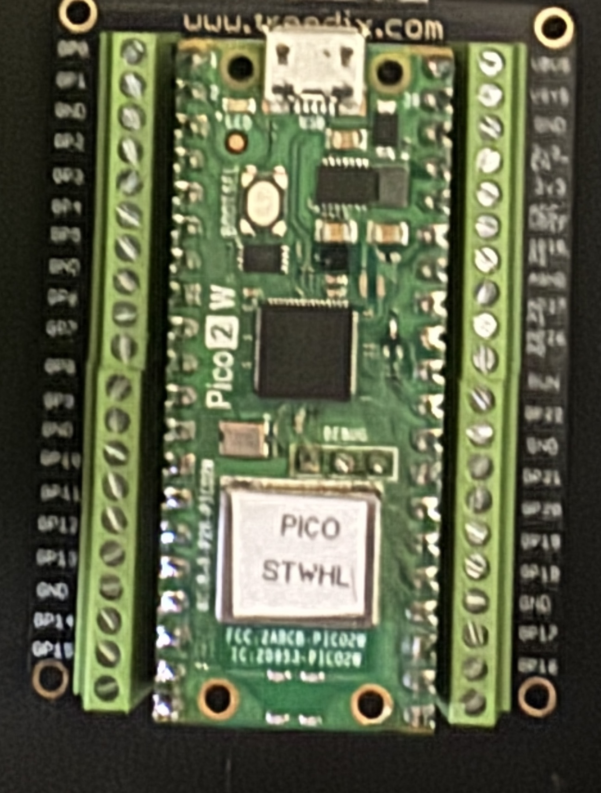 | Hardware photo uploaded from local BCM repo. |
| 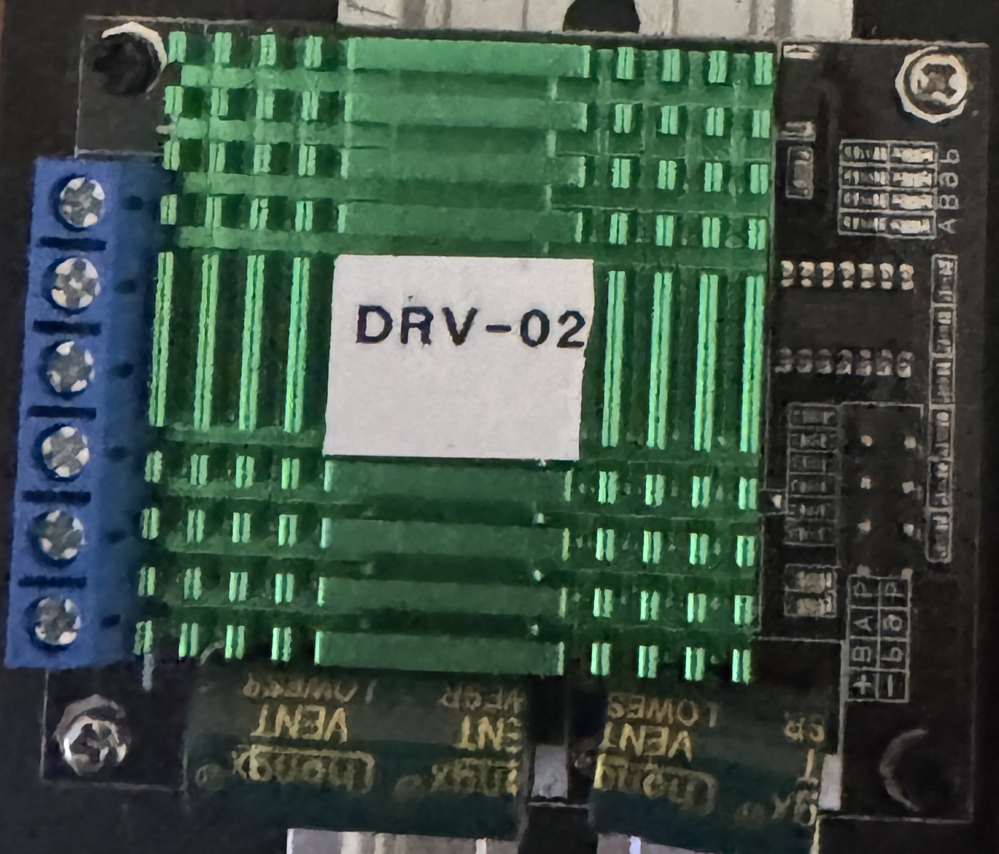 | Hardware photo uploaded from local BCM repo. |
| 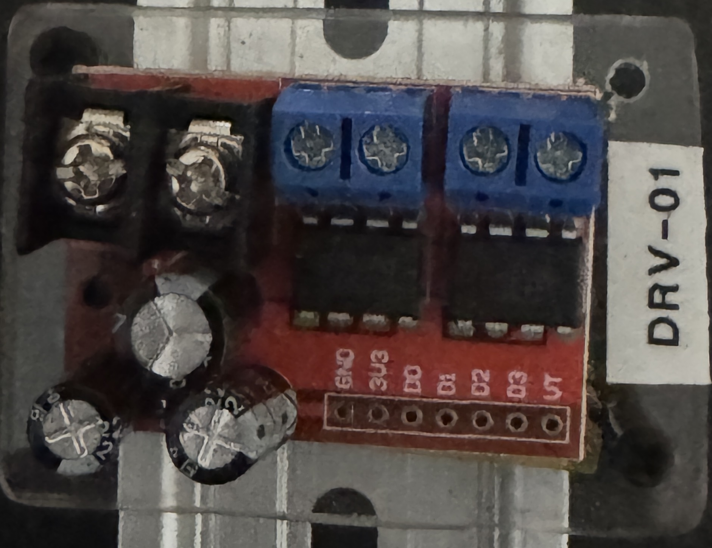 | Hardware photo uploaded from local BCM repo. |
| 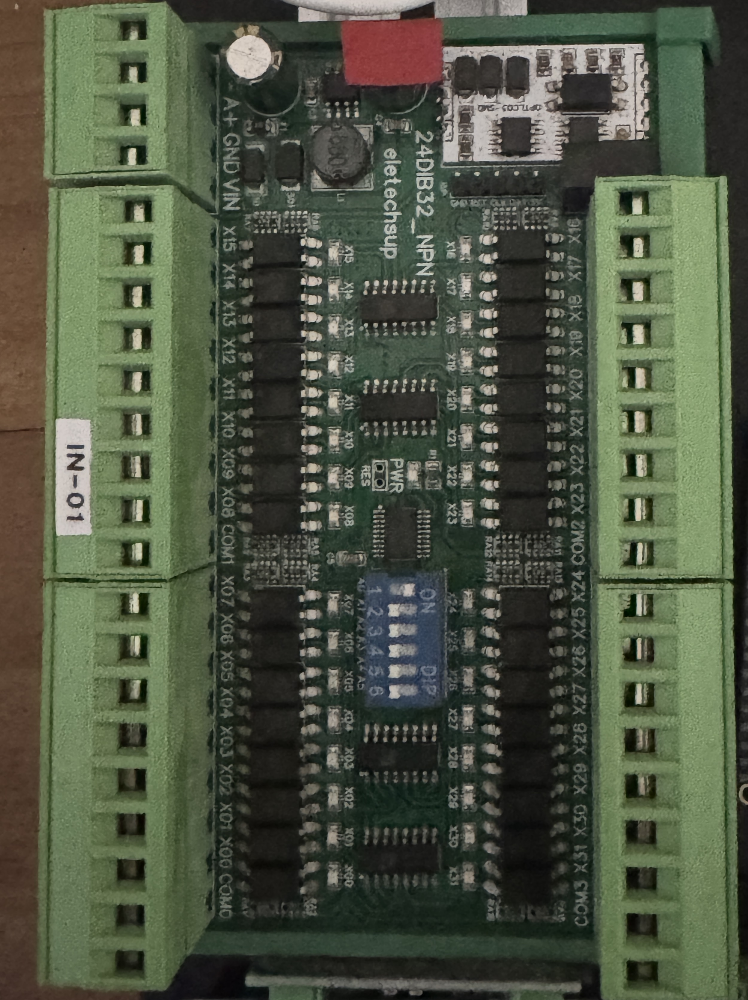 | Hardware photo uploaded from local BCM repo. |
| 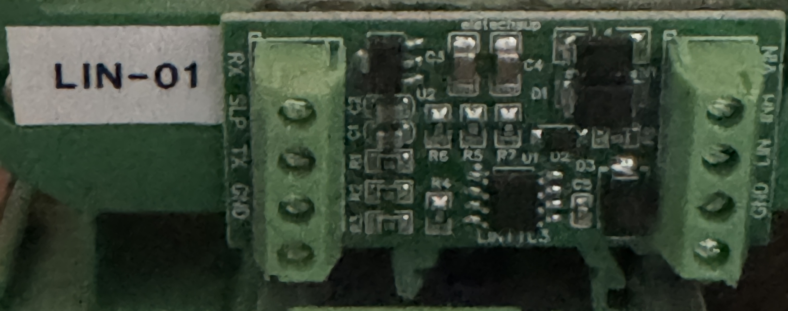 | Hardware photo uploaded from local BCM repo. |
| 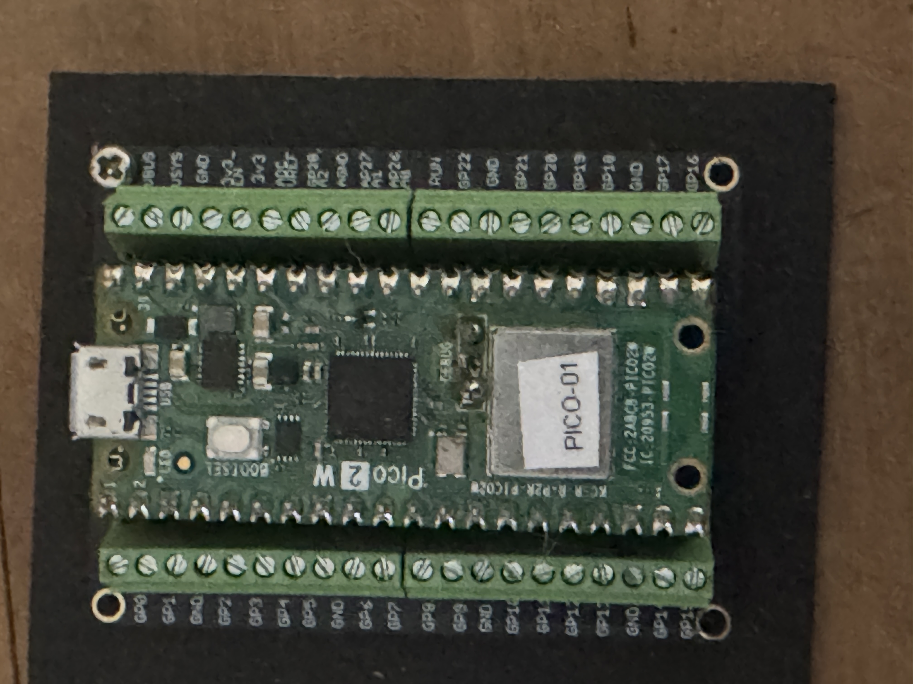 | Hardware photo uploaded from local BCM repo. |
| 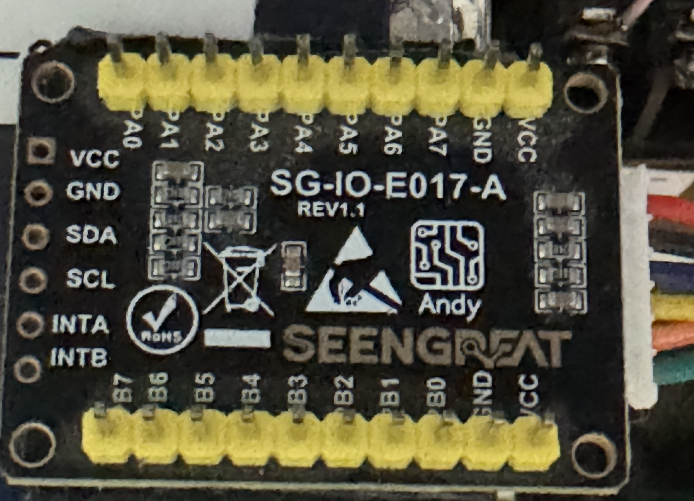 | Hardware photo uploaded from local BCM repo. |
| 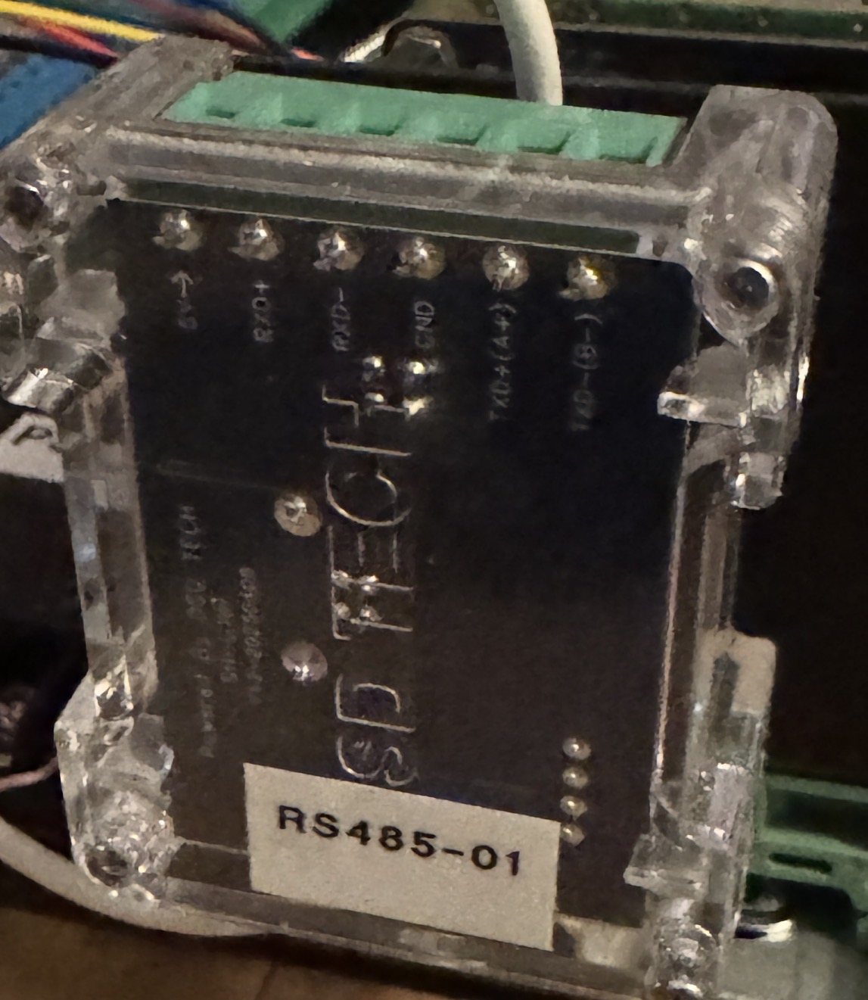 | Hardware photo uploaded from local BCM repo. |

## Board Labels From Current Photo Batch

| Photo / visible label | Project name | What it is | Main use | Raw car wiring safe? | Notes |
|---|---|---|---|---|---|
| `RLY-01`, 8 blue relays | Relay Board | 8-channel 12V relay module | Loads that need relay isolation/current handling | Control side only | Use for relay-driven loads after coil/current verification. |
| `OUT-01` | Output Board | 16-channel output board, likely MOSFET output module | Main positive-switched BCM outputs | Yes, within verified current limit | Verify exact model/current rating before assigning high-current loads. |
| `PICO-02` | Pico 2 Board | Raspberry Pi Pico on screw-terminal carrier | Local logic/control node | No | Logic-level only unless protected by interface hardware. |
| `PICO STWH` / Pico 2 W | Steering Wheel Pico | Raspberry Pi Pico W on screw-terminal carrier | Steering wheel buttons/wireless control | No | Intended for button inputs and wireless BCM communication. |
| `DRV-02` | Window Driver / Motor Driver | High-current H-bridge style driver board | Power windows or other reversible motor loads | Motor side only | Verify terminal labels and current rating before final use. |
| `DRV-01` | Small Driver Board | Small dual-driver/MOSFET style board | Small loads or test driver functions | Not for unknown raw loads yet | Needs pinout/current verification before assignment. |
| `IN-01`, 24DIB32 NPN marking | Input Board | 32-channel isolated digital input board | Main factory switch/input interface | Yes, if wired per board input requirements | Primary input board for doors, brake, clutch, wipers, lights, etc. |
| `LIN-01` | LIN Adapter | TTL-LIN transceiver board | LIN bus experiments/devices | No | Use only for LIN communication wiring, not general switches/loads. |
| `PICO-01` | Pico 1 Board | Raspberry Pi Pico on screw-terminal carrier | Local logic/control node | No | Logic-level only unless protected by interface hardware. |
| `SEE... SG-IO-E017-A`, `VCC/GND/SDA/SCL/INTA/INTB`, `PA0-PA7`, `PB0-PB7` | Logic I/O Expander | MCP23017-style I2C GPIO expander board | Extra low-voltage GPIO | No | Not 12V safe. Use only behind conditioning/interface circuits. |

## Recommended Descriptive Photo Filenames

The current files are stored as camera filenames in `assets/images/`. If renamed later, use names like these:

| Board | Recommended filename |
|---|---|
| Relay Board | `assets/images/rly-01_8ch_relay_board.jpg` |
| Output Board | `assets/images/out-01_16ch_output_board.jpg` |
| Pico 2 Board | `assets/images/pico-02_terminal_board.jpg` |
| Steering Wheel Pico | `assets/images/pico-steering-wheel_terminal_board.jpg` |
| Window Driver / Motor Driver | `assets/images/drv-02_motor_driver.jpg` |
| Small Driver Board | `assets/images/drv-01_small_driver_board.jpg` |
| Input Board | `assets/images/in-01_32ch_input_board.jpg` |
| LIN Adapter | `assets/images/lin-01_ttl_lin_adapter.jpg` |
| Pico 1 Board | `assets/images/pico-01_terminal_board.jpg` |
| Logic I/O Expander | `assets/images/mcp23017_logic_io_expander.jpg` |

## Working Rules

- Anything connected directly to factory 12V wiring must be isolated, protected, or designed for automotive 12V input.
- Pico boards and raw MCP23017 boards are logic-level devices only.
- Output boards and driver boards need final current limits verified before powering real vehicle loads.
- Board labels used in wiring docs should match the physical labels: `IN-01`, `OUT-01`, `RLY-01`, `DRV-01`, `DRV-02`, `LIN-01`, `PICO-01`, `PICO-02`.
