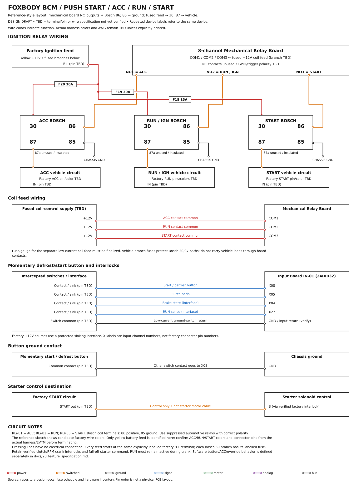

# FoxbodyBCM Schematics

All 10 existing sheets have been redrawn as terminal-to-terminal line drawings (2026-10-07): labelled rectangular devices, conductors attached to labelled terminals, separate control/load paths and explicit ground returns. The push-start sheet follows the three-relay reference layout.

These SVG files are editable design drafts. Known relay terminal numbers and channel assignments are printed; unresolved factory connector pins, hardware terminals, harness colors and wire gauges are marked **TBD**. Repeated labelled boxes represent the same physical device, not additional boards. Diagram colors show electrical function, not actual harness insulation color.

Regenerate all sheets with `python tools/redraw_schematics.py` from the repository root. Edit the generator when changing the diagrams so future regeneration preserves the changes.

## Start here

Mechanical relay channels: **1 ACC, 2 RUN, 3 START, 4 rear defrost**. NO1–NO4 supply Bosch coil terminal 86; terminal 85 returns to chassis. Bosch 30/87 carry the separately fused vehicle loads. Y07 and Y15 are now spare in the provisional MOSFET map.

## Board names used on drawings

- **BCM Controller** = Raspberry Pi 4B.
- **Input Board** = Eletechsup 24DIB32 NPN 32-channel RS485 digital-input board.
- **Output Board** = Eletechsup OPMSD16 PNP 12V 16-channel MOSFET output board.
- **Window Driver** = selected dual high-current H-bridge; 9-30V supply, 3.3/5V logic, A/B direction plus PA/PB PWM; one channel per window.
- **Lock Driver** = selected dual H-bridge; 3-14V supply, 2.2-6V logic, 5A continuous / 9A peak per channel; one channel per lock actuator.
- **I/O Expander** = MCP23017.
- **RS485 Adapter** = isolated USB-RS485/RS422 adapter.
- **Analog Board** = protected ADC/front-end, exact hardware still to freeze.
- **5V Power Supply** = 12/24V to 5V, 10A / 50W DC-DC converter.

## Current sheets

- [01_core_power.svg](01_core_power.svg) - battery, F00 main distribution, 5V supply, Input/Output boards, Window/Lock drivers and ground architecture.
- [02_input_board.svg](02_input_board.svg) - Input Board terminals, X00-X31 assignments, NPN common wiring and raw +12V signal-conditioning examples.
- [03_output_board.svg](03_output_board.svg) - Output Board direct-load rules, provisional Y01-Y16 assignments, mechanical relay channels 1-4 and required logic interface.
- [04_door_locks_hbridge.svg](04_door_locks_hbridge.svg) - solid-state lock wiring using the selected dual 5A/9A Lock Driver.
- [05_windows_hbridge.svg](05_windows_hbridge.svg) - solid-state power-window wiring using the selected dual 9-30V high-current Window Driver.
- [06_lighting_horn_defrost.svg](06_lighting_horn_defrost.svg) - headlights, high beams, marker/turn/hazard, horn, rear defrost, puddle and courtesy lighting.
- [07_wipers_washer_hatch.svg](07_wipers_washer_hatch.svg) - wiper/park, washer, hatch release and fuel-door actuator.
- [08_start_ignition_accessory.svg](08_start_ignition_accessory.svg) - ACC/RUN/START Bosch terminals, mechanical-board contacts, momentary button and interlock connections. Behavior is maintained in `../20_feature_specification.md`.
- [09_cooling_fans.svg](09_cooling_fans.svg) - separate high-current fan feeds, control authority and fan-current sensing.
- [10_sensors_analog_comms.svg](10_sensors_analog_comms.svg) - fuel sender, current sensors, digital sensors, TPMS, IMU, RS485, MicroSquirt and dash communications.

## Fuse schedule

See `../24_fuse_schedule.md` for F00-F23 and their amperage values. Every fuse shown on these drawings has a design amperage assigned.

## Important installation status

The architecture is laid out, but **do not terminate the complete vehicle harness from these files yet**. Before INSTALLATION RELEASE:

1. Bench-verify the actual screw-terminal and signal-header order/polarity on the exact Input Board, Output Board, Window Driver and Lock Driver in hand.
2. Freeze the Output Board logic-level/sinking interface.
3. Freeze the Analog Board/front-end.
4. Copy exact factory connector IDs, motor terminal IDs and relevant factory wire colors from the 1988 Mustang EVTM/donor harness.
5. Assign actual new-harness wire colors, gauges and splice IDs.
6. Measure/verify heavy-load current and adjust branch fuse values where appropriate.

Older Cytron and relay-heavy window/lock drawings are superseded. Windows and locks use the selected H-bridge boards, not reversing Bosch relay pairs.

## Reading the drawings

- A labelled circle at a device boundary is a wire terminal. Solid junction dots connect branched feeds. Wire crossings without a solid dot do not connect; white gaps keep crossing paths distinct.
- A grouped label such as X1–X16 means multiple separate conductors, not one wire shorting channels together.
- X08 is the repurposed defrost/start button. X09 needs a separate physical contact if used; software intent handling is not a second wire.
- Analog channels, fan controller terminals and Ford wiper park circuitry remain unresolved. Their functional labels are not a verified installation pinout.
